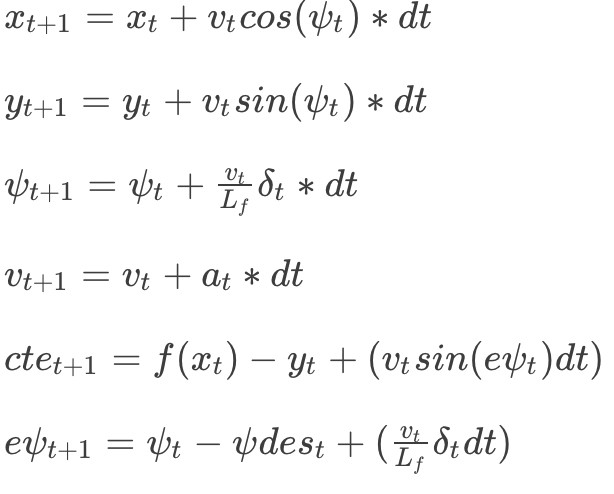

# CarND-Controls-MPC
Self-Driving Car Engineer Nanodegree Program

---

## Dependencies

* cmake >= 3.5
 * All OSes: [click here for installation instructions](https://cmake.org/install/)
* make >= 4.1(mac, linux), 3.81(Windows)
  * Linux: make is installed by default on most Linux distros
  * Mac: [install Xcode command line tools to get make](https://developer.apple.com/xcode/features/)
  * Windows: [Click here for installation instructions](http://gnuwin32.sourceforge.net/packages/make.htm)
* gcc/g++ >= 5.4
  * Linux: gcc / g++ is installed by default on most Linux distros
  * Mac: same deal as make - [install Xcode command line tools]((https://developer.apple.com/xcode/features/)
  * Windows: recommend using [MinGW](http://www.mingw.org/)
* [uWebSockets](https://github.com/uWebSockets/uWebSockets)
  * Run either `install-mac.sh` or `install-ubuntu.sh`.
  * If you install from source, checkout to commit `e94b6e1`, i.e.
    ```
    git clone https://github.com/uWebSockets/uWebSockets
    cd uWebSockets
    git checkout e94b6e1
    ```
    Some function signatures have changed in v0.14.x. See [this PR](https://github.com/udacity/CarND-MPC-Project/pull/3) for more details.

* **Ipopt and CppAD:** Please refer to [this document](https://github.com/udacity/CarND-MPC-Project/blob/master/install_Ipopt_CppAD.md) for installation instructions.
* [Eigen](http://eigen.tuxfamily.org/index.php?title=Main_Page). This is already part of the repo so you shouldn't have to worry about it.
* Simulator. You can download these from the [releases tab](https://github.com/udacity/self-driving-car-sim/releases).
* Not a dependency but read the [DATA.md](./DATA.md) for a description of the data sent back from the simulator.


## Basic Build Instructions

1. Clone this repo.
2. Make a build directory: `mkdir build && cd build`
3. Compile: `cmake .. && make`
4. Run it: `./mpc`.


## Implementation

### The Model

The following model is used for this project:



Where  'x, y'  are car's positions in 'x' and 'y' directions, `psi` is car's heading direction 'v' is car's velocity, 'cte' is cross-track error , 'epsi' is orientation error, 'Lf' is the distance between the car of mass and the front wheels (this is provided by Udacity's seed project), 'a' is car's acceleration and 'delta' is steering angle.

We want to find the accelaration and steering angle such a way that minimize the objective function.
The objective function is combination of different factors that were implimented from line [52](./src/MPC.cpp#L52) to line [77](./src/MPC.cpp#L77) in MPC.cpp.

The value of weight for each of these factors were tuned manually to make sure the the car can drive through the track with minimal acceleration change and wiggling.

### Timestep Length and Elapsed Duration ( N & dt )

The number of points 'N' impacts the duration of calculation 'dt' drasticly affect the controller performance. While too points make the controller to run slower, few number of points run the car out of the track. Using try and error approach, I found N = 7 and dt = 0.1 to get the best performance.

### Polynomial Fitting and MPC Preprocessing

The waypoints preprocessd from line [102](./src/main.cpp#L102) to line [111](./src/main.cpp#L111) in the main.cpp. 

### Model Predictive Control with Latency

To handle actuator latency handled in main.cpp from line [123](./src/main.cpp#L123) to line [135](./src/main.cpp#L135). We used new set of initial values considering the latency.

## Simulation

### The vehicle must successfully drive a lap around the track.

The vehicle successfully drives around the track. A short video can be find [here](./videos/trim.mov).
